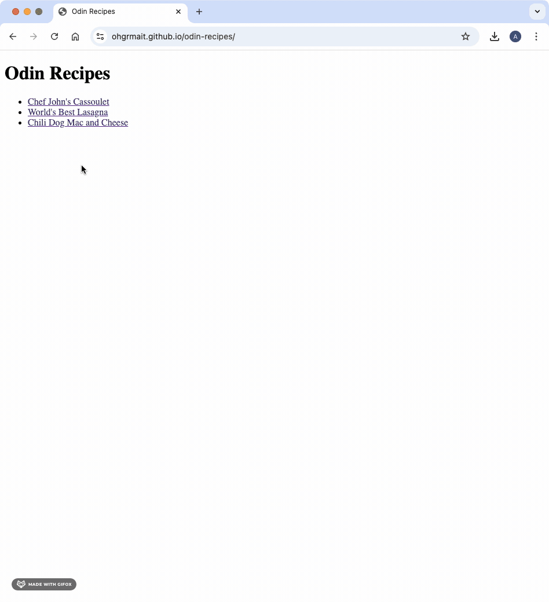
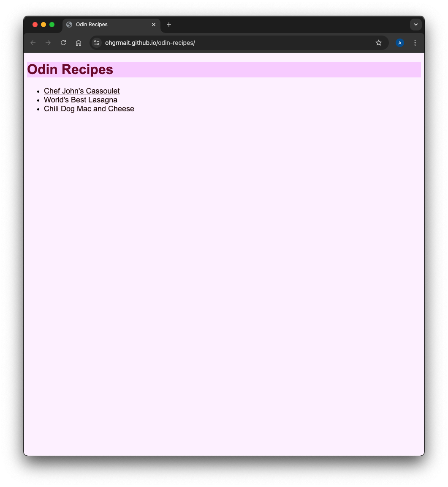
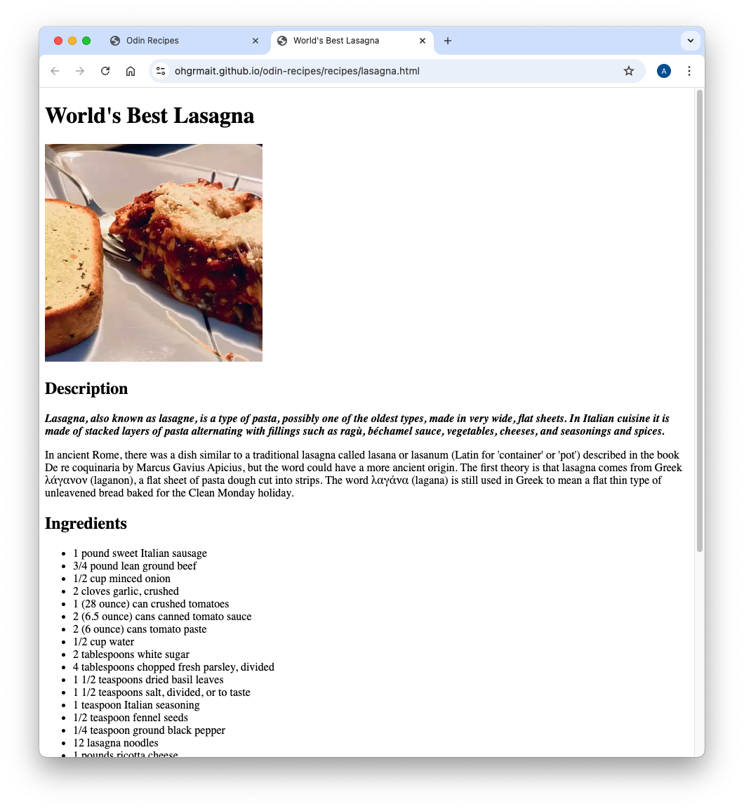
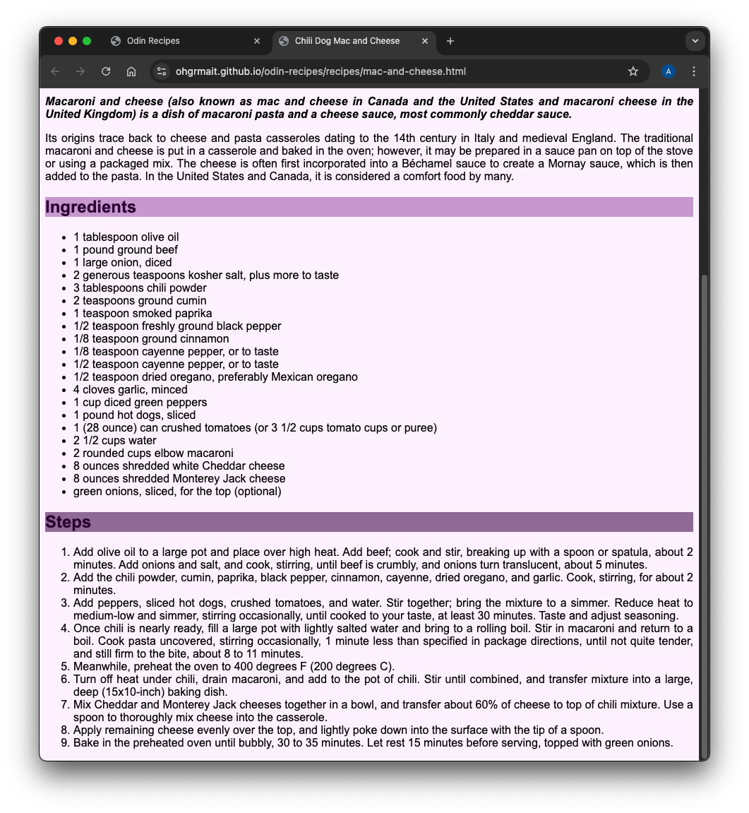

# odin-recipes
A Basic Recipe Website

## Live Demo

## General Info
[This project](https://www.theodinproject.com/lessons/foundations-recipes) is from the [Foundations Course](https://www.theodinproject.com/paths/foundations/courses/foundations) in [The Odin Project](https://www.theodinproject.com/about).

`odin-recipes` is a basic recipe website which consists of a main index page with links to a few recipes. Each recipe has an image of the finished dish, a small description, the set of ingredients and the steps needed to recreate the dish.

## Screenshots

## Technologies
- ***Git***
- ***CLI***
- ***HTML***
- ***GitHub***

## Self Reflections
This whole process was very stimulating. I learned a lot of stuff like setting up the project, using the command line interface, the basics of git, foundational knowledge of HTML, the proper way to use commit messages, writing a README, and publishing/viewing the project on the web.

## Acknowledgements
- Credit for images and text goes to [Allrecipes](https://www.allrecipes.com/) and [Wikipedia](https://www.wikipedia.org/) respectively.
- Credit for README goes to [ritaly's README cheatsheet](https://github.com/ritaly/README-cheatsheet) and [ArjunSaili1's comment](https://github.com/TheOdinProject/curriculum/discussions/25472#discussioncomment-5889343).

## Contact and Support
Please do not hesitate to contact me at ***ohgrmait_02945*** on discord for any project queries.