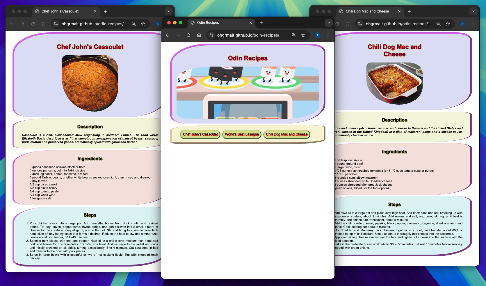
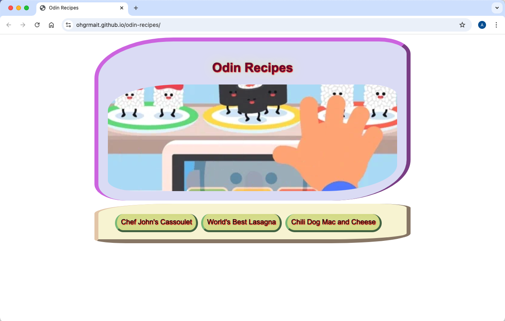

  <h1>Odin Recipes</h1>

  A Basic Recipe Website ([live preview](https://ohgrmait.github.io/odin-recipes/))

  

## About
This project shows a basic recipe website which consists of a main index page with links to a few recipes. Each recipe has an image of the finished dish, a small description, the set of ingredients and the steps needed to recreate the dish.[^1]

[^1]: [This project](https://www.theodinproject.com/lessons/foundations-recipes) is from the [Foundations Course](https://www.theodinproject.com/paths/foundations/courses/foundations) in [The Odin Project](https://www.theodinproject.com/about).

## Showcase

  
  
This is a screenshot of the index page.

  
  
This is a screenshot of the sample page 1.

  
  
This is a screenshot of the sample page 2.

  
  
This is a screen cast of the recipe website.

## Technologies
- ***Git***
- ***CLI***
- ***CSS***
- ***HTML***
- ***GitHub***
- ***GitHub Pages***

## Self Reflections
- > This whole process was very stimulating. I learned a lot of stuff like setting up the project, using the command line interface, the basics of git, foundational knowledge of HTML, the proper way to use commit messages, writing a README, and publishing/viewing the project on the web.

- > An update: I updated my knowledge and added a bit of CSS. This included the use of different kinds of selectors, ways to group and chain selectors, and combinators. This also had various different CSS properties related to color, background-color, typography properties, etc. Lastly, I kept in mind the CSS cascade, inheritance and rule order.

- > Another update: I did some tinkering and extended the project again. After learning how to inspect HTML and CSS, and how to utilize the standard and alternative box model, I applied additional CSS to make it relatively "prettier" (than before).

- > This is the final update. I did two major things. First was the use of the [Markup Validation Service](https://validator.w3.org/#validate_by_input) to make sure that all HTML files are syntax-proper. This process was worthwhile because I learned not to put multiple images tags in a div next to each other and [when to use css background-image vs img](https://stackoverflow.com/questions/492809/when-to-use-img-vs-css-background-image). Second was the over-engineering that happened as a result of writing the README and the website (trying to make it look good) but I count it towards (somewhat) wasted effort.

## Acknowledgements
- Credit for images and text goes to [Allrecipes](https://www.allrecipes.com/), [GIPHY](https://giphy.com/) and [Wikipedia](https://www.wikipedia.org/) respectively.
- Credit for README goes to [ritaly's README cheatsheet](https://github.com/ritaly/README-cheatsheet) and [ArjunSaili1's comment](https://github.com/TheOdinProject/curriculum/discussions/25472#discussioncomment-5889343).

## Contact and Support
- Please do not hesitate to contact me at ***ohgrmait_02945*** on discord for any project queries.
- This project will no longer be worked upon and no further support will be provided for this project.[^2]

[^2]: The [TOP strategy guide](https://dev.to/theodinproject/learning-code-f56) makes it clear to [focus on the point of the assignment](https://dev.to/theodinproject/learning-code-f56#:~:text=Focus%20on%20the%20point%20of%20the%20assignment) and that [foundations isn't a strong portfolio generator](https://dev.to/theodinproject/learning-code-f56#:~:text=Foundations%20isn%E2%80%99t%20a%20strong%20portfolio%20generator), so I won't be wasting anymore time here.
